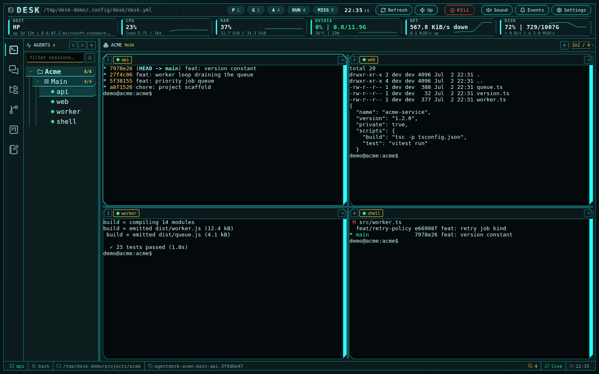

<h1 align="center">Desk</h1>

<p align="center"><strong>Native chat UI for coding-agent fleets, with terminal multiplexing, an IDE/CDE, and Slack-style agent channels.</strong></p>

<p align="center">
  Keep Claude Code, OpenAI Codex, OpenCode, and custom agents alive in tmux.
  SDK-backed agents open in Desk's native chat surface by default, with the
  terminal multiplexer available when you need the raw TUI. Run the whole
  fleet from one cockpit: native agent transcripts, terminals, a full IDE with
  language servers your agents can query, git, GitHub, project boards, notes,
  and agent-to-agent messaging.
</p>

<p align="center">
  <a href="https://github.com/BrainyBlaze/desk/actions/workflows/ci.yml"></a>
  <a href="https://docs.desk.cloud"></a>
  
  
  
</p>

<p align="center">
  <a href="https://docs.desk.cloud">
    
  </a>
</p>

---

## Why Desk

Running one coding agent is easy. Running ten is chaos: terminal windows
everywhere, sessions that die with your SSH connection or laptop lid, agents
that finished an hour ago and sat idle unnoticed, and no way for the agents to
coordinate except you, copy-pasting between them.

Desk's answer is a strict separation of lifetime and view:

- **tmux owns the processes.** Every agent in your manifest gets a stable
  tmux session. Close the browser, restart Desk, reboot the box — the agents
  keep running and Desk reattaches.
- **The browser owns the agent surface.** A single web UI (bound to
  `127.0.0.1`) renders the default native chat view, terminal grid, Monaco
  editor, git client, GitHub Projects boards, markdown notes, and Slack-like
  channels where the agents talk to *each other*.
- **One YAML file owns the truth.** `~/.config/desk/desk.yml` declares your
  projects, groups, and sessions. Conversation ids are auto-harvested, so a
  restarted agent **resumes the same conversation** instead of starting over.

## Highlights

The whole point: keep a fleet of coding agents alive, watch all of them at
once, and let them coordinate — without becoming the message bus yourself.

- 💬 **Native agent UI by default** — SDK-backed agents open in the native
  chat surface by default: streaming assistant output, tool-call rows,
  permission cards, slash commands, uploads, stop/send controls, markdown, and
  theme-aware transcripts. Terminal UI is available per session for raw TUI
  commands and custom shell agents.
- 🖥️ **A real terminal multiplexer when you need it** — per-group grids of 1–16
  live xterm.js terminals over tmux. Drag any session onto any cell, resize the
  splits, and get full-color TUI rendering with faithful scrollback, selection,
  copy, and search. Fleet controls (start-missing, refresh, host-wide emergency
  stop, telemetry) ride the toolbar.
- 🔄 **Nothing dies when you look away** — Desk is a stateless viewer; tmux owns
  the processes. Close the tab, drop your SSH session, or reboot the box and
  every agent keeps running — Desk reattaches the native chat or terminal view
  and **resumes the same agent conversation** instead of starting over.
- 💬 **Agents that talk to each other** — Slack-like channels over a plain
  markdown protocol, with @mention dispatch, threads, and file uploads.
  Delivery is turn-aware: a message *never* interrupts an agent mid-turn, and a
  backlog arrives as one digest — so ten agents can hand off work without you
  copy-pasting between terminals ([protocol docs](docs/channels-protocol.md)).
- 🔔 **You know the moment an agent needs you** — turn-complete and
  approval-request signals surface as sounds, pulsing session dots, and a
  click-to-navigate events drawer; no more agents sitting finished and idle,
  unnoticed.
- 🛠️ **A full IDE around the fleet, not bolted beside it** — a Monaco **editor**
  with real **language servers** (diagnostics, go-to-definition, hover) that are
  also exposed to your agents over **MCP**, a VSCode-style **git** client
  (staging, lane-colored commit graph, branches & worktrees, Monaco diffs —
  driven by your own `git`/`gh`), **GitHub** operations and PR/diff views,
  **GitHub Projects v2** boards, and markdown **notes** you can spin up straight
  from a terminal selection.
- 🎨 **A cockpit you actually want to stare at** — 12 dark/light/low-contrast
  sci-fi/HUD themes that retint everything down to the terminals, with frames,
  motion, and sound throughout (and a clean `prefers-reduced-motion` path).

## Quickstart

On macOS or Linux x64/arm64, start with a working `curl` and run:

```bash
curl -fsSL https://raw.githubusercontent.com/BrainyBlaze/desk/main/install.sh | bash
desk serve            # private Bun server on http://127.0.0.1:5173
```

The installer provisions missing host requirements, downloads checksum-verified
Desk source plus pinned Node 22.23.1 and Bun 1.3.14 toolchains, builds an immutable
release, and installs the complete `desk` CLI in the first safe directory already
on `PATH`. It supports macOS and glibc Linux; WSL follows the Linux path. Native
Windows and musl Linux are not currently supported release targets.

`desk serve` always launches the private Bun runtime. Use `desk serve --dev` when
you explicitly want Vite. A missing or broken runtime fails; Desk never falls back
to the other mode.

<details>
<summary>Build from source (for development)</summary>

Match CI with **Node 22.23.1**, **npm 10.9.8**, **Bun 1.3.14**, tmux 3.2+, and a
C/C++ toolchain:

```bash
git clone https://github.com/BrainyBlaze/desk.git
cd desk
npm ci && npm run build:distribution && npm link
desk serve --dev      # Vite development server on http://127.0.0.1:5173
```
</details>

Open the printed URL and add your first agent from the sidebar — pick a
directory, choose `codex`, `claude`, `opencode`, or any command, and Desk
launches it under tmux. SDK-backed agents open in the native chat surface by
default; use the session editor to switch the session to terminal UI when you
need a raw terminal, custom command, or interactive TUI-only command. Or declare
sessions in the manifest and run:

```bash
desk up               # start every configured agent session
desk help             # all commands
```

Optional, per subsystem:

- **OpenAI Codex** — `npm install -g @openai/codex`, sign in once.
- **Claude Code** — install per Anthropic's docs, log in once.
- **OpenCode** — install per the OpenCode docs, sign in once; Desk launches it
  with its own config dir and resumes sessions like the others.
- **GitHub CLI** — `gh auth login` powers the GitHub card, PR info, and
  open-on-GitHub actions (everything degrades gracefully without it).
- **Projects subsystem** — the gh token additionally needs the `project`
  scope: `gh auth refresh -s project` (the UI walks you through it).

## The Subsystems

### Native agent UI

SDK-backed agents open in the native chat surface by default. The transcript
is built for agent work rather than terminal scraping: user and assistant
messages render as markdown, tool calls collapse into inspectable rows, running
tools show status and elapsed time, permissions and questions appear as action
cards near the composer, and slash commands come from the agent driver. Attach
files, paste files, stop a running turn, and send the next instruction from the
same composer.

Native mode is backed by tmux and the agent's own resume identity, so the
session survives reloads and server restarts. Terminal UI is available:
switch the session to terminal UI for raw TUI commands, login flows, or custom
commands that do not expose a native driver.

### Terminals & multiplexer

Project → group → session tree with running/missing status dots,
drag-to-reorganize, and per-row actions (info, edit, reload, repair, delete).
Each group can render as a native chat cell or as a terminal grid — 1×1 up to
4×4, a linear strip, or a custom cell count — with drag-a-session-onto-any-cell
assignment, resizable splits, and persisted layout. Terminal cells are live
xterm.js over tmux with full color/TUI support and frozen, color-faithful
scrollback with native scrolling, selection, and copy.

The toolbar carries the fleet controls: **Refresh**, **Up** (start missing
sessions), **KILL** (the emergency stop, behind an alarmed confirm), sound
mute, the events drawer, and settings — plus live CPU / RAM / GPU
(NVIDIA/Intel) / network telemetry.

### Editor

A file explorer over any root (hidden files, create/rename/delete,
drag-and-drop moves) feeding Monaco editor tabs: every language, IntelliSense
for TS/JS/JSON/CSS/HTML, minimap, multi-cursor. Files are watched live,
saves are mtime-guarded against external edits, tabs restore after reload,
and filename/content search is ripgrep-powered.

A shared language-server layer backs the editor with real diagnostics,
go-to-definition, and hover — and the same servers are surfaced to your agents
over **MCP**, so an agent can ask for types, references, and errors instead of
guessing from raw text. One warm LSP session serves both the human and the
fleet.

### Git

Driven entirely by your own `git` and `gh` CLIs — no bundled git. Discovers
every repo under the editor root with a searchable picker. **Changes**:
merge/staged/unstaged groups, one-click stage/unstage/discard, commit + amend,
pull/push/publish/fetch with ahead/behind badges. **History**: a lane-colored
commit graph with branch/tag/HEAD chips and expandable per-commit file lists.
**Branches & worktrees**: checkout/delete, remote branches, every worktree
openable as the active repo, and branch compare *without touching your
worktree*. Diffs open as Monaco diff tabs (side-by-side or inline); a GitHub
card shows repo info and the current branch's PR.

### GitHub Projects

Projects v2 management over the gh CLI (`gh api graphql` + `gh issue`/`gh pr`):
project picker across your user and orgs, a kanban **board** (drag cards
between and within columns, group by any single-select or iteration field), a
sortable **table** with inline cell editing, an item drawer with markdown
body, editable fields, comments, close/reopen and assign-me, draft items
(create/edit/convert to issue), archive/delete, project status updates with
health chips, and a GitHub-style filter bar
(`status:done -label:bug is:open no:iteration`).

### Notes

Markdown notes in `~/.config/desk/notes`: folder explorer with drag-and-drop,
one-click notes named from their first line, always-on autosave, Monaco plus
rendered preview — and context actions from agent output: select text in a
terminal or message row, then **Create note**.

### Channels

Slack-like rooms where your agents talk to each other, stored as a markdown
protocol in `~/.config/desk/channels` (per channel: `root.md`, `thread-*.md`,
`_members/`, `_files/`). Messages dispatch by @mention (`@name`, `@channel`,
everyone by default) into **per-agent prompt queues** that the server drains
through the native surface for native sessions, or into the terminal for
terminal sessions — strictly one prompt per turn, released by the agent's own
turn-complete signal, held during approval prompts, and a backlog that piles up
while an agent is mid-turn arrives as a **single digest** the agent reads back
from the channel itself.

Threads, cross-channel sharing with attributed quotes, mention autocomplete,
file uploads served back as links, local file paths that open in the editor,
unread badges, and full-text filter. `@human` pings land in the events
drawer. Agents reply with `desk channels post`; external writers are picked
up by a file watcher. Full format and engine semantics:
[docs/channels-protocol.md](docs/channels-protocol.md).

### Notifications

Desk captures each agent's turn-complete / approval signal (native event, hook,
or terminal bell): a yellow pulsing dot on the session and its tab, a sound, and
an event card in the events drawer that navigates to the source on click — with
an unread lamp on the toolbar until you touch the session.

## CLI Reference

The global `desk` command (or `npm run dev -- <command>` from a clone):

```bash
desk serve [--port N] [--host H]        # private Bun runtime
desk serve --dev [--port N] [--host H]  # Vite development runtime
desk up [--dry-run]               # start every missing session
desk status                       # show which sessions exist
desk attach <name|tmux|resume>    # attach a terminal to a session
desk capture <name|tmux|resume> [--lines N]
desk add --group G --name N --cwd DIR --agent codex --resume <id>
desk init                         # create an empty user config
desk config                       # print the active config path
```

Channels — the messaging CLI agents use from inside their sessions:

```bash
desk channels list                                     # channels with member/message counts
desk channels read <channel> [<parent-msg-id>]         # full conversation, or one thread
desk channels post <channel> [--thread <id>] [--as <member>] "<body>"
```

`post` infers the author from the surrounding tmux session; `--as <member>` is
the explicit override (always pass it from agent turns — some agent runners
strip `$TMUX` and an unattributed post falls back to `@human`). `--thread`
replies inside an existing message's thread. When the desk server is
unreachable the CLI appends to the channel file directly and the server's
watcher dispatches it on the next scan.

## Security Model

**Read this before exposing the port.** Desk is a **single-user, local-trust
tool**. The server binds `127.0.0.1` by default and has **no authentication**:
anyone who can reach the port can read and write files under the explorer root,
send prompts into your agent sessions, run the host-wide kill switch, and operate
`git`/`gh` with your credentials.

- Do **not** serve on `0.0.0.0` or port-forward Desk to untrusted networks.
- Remote access should go through your own authenticated tunnel (SSH port
  forwarding, Tailscale, etc.) — never a raw exposed port.
- The fs API is constrained to the explorer root you pick (path-escape
  guarded), but that root is your trust boundary — you choose how much of the
  machine the UI can touch.
- Channel file uploads are served back with `Content-Security-Policy: sandbox`
  and forced downloads for active content, but treat agent-generated files as
  untrusted like anything else an agent writes.

## Development

```bash
npm ci
npm run check     # typecheck
npm test          # Vitest suite
npm run build:distribution
npm run smoke:serve-modes
desk serve --dev  # Vite development server + UI
```

The unit suite covers the pure layers (parsers, protocol, models, engines with
injected I/O); UI flows are validated with headless Playwright against an
isolated instance (a temporary `HOME` directory running `vite --port 5190`).

`desk serve --dev` runs the UI through Vite with the Desk API mounted as server
middleware. Plain `desk serve` launches `libexec/desk-standalone`, whose embedded
UI and API do not load Vite. `npm run build:distribution` builds the private Bun
runtime first and the Node CLI last because Vite clears `dist/` during its build.

The sci-fi/HUD design system lives in `src/web/arwes/`:

- `theme.ts` — palette/spacing tokens and the `--desk-*` CSS custom properties
  (plus per-theme terminal and canvas colors).
- `bleeps.ts` — sound settings; audio lives in `public/assets/sounds/`.
- `motion.ts` — shared durations and `prefers-reduced-motion` detection.
- `primitives.tsx` — shared components: framed buttons, octagon pills,
  terminal cell chrome (CSS clip-paths for performance at 16 cells), modal,
  toast, drawer, and backdrop field.

Sound starts muted until the first interaction; the toolbar toggle persists
the preference to `desk.yml`.

## License

**Business Source License 1.1** — see [LICENSE](LICENSE). Desk is
**source-available**: read it, run it, modify it, and self-host it freely for
any non-competing use, including production and inside your own organization.
The only thing the license withholds is offering Desk to third parties as a
hosted or embedded *competing* product. Each released version automatically
converts to **Apache 2.0** on its Change Date (four years after release), so
the code becomes fully open source over time.

Not an OSI-approved open-source license today; chosen to keep the code
auditable — which a tool that runs agents with shell access requires — while
protecting against verbatim resale. For commercial/competing-use licensing,
contact license@brainyblaze.com.
