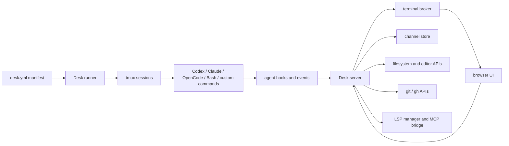

Desk is a local system, not a hosted control plane. The server runs on the same
machine as the code, tmux sessions, credentials, and agent CLIs. The browser is
an operator view over that local runtime.

## Runtime components

## Ownership boundaries

### Manifest

`~/.config/desk/desk.yml` describes desired state:

- projects and working directories
- groups and terminal layouts
- sessions and agent kinds
- custom commands
- permission bypass settings
- resume identifiers
- UI settings

Desk writes the manifest atomically when you edit sessions or layout from the
UI.

### tmux

tmux owns process lifetime. Every configured session maps to a deterministic
tmux session name unless you set one explicitly. Desk can start missing
sessions, attach to existing sessions, capture scrollback, and resize tmux
windows, but the agent process is not owned by the browser.

### Server

The server exposes the UI assets and the local API. In source mode, `desk serve`
starts Vite. In standalone mode, the binary serves the embedded UI bundle and
the same backend routes without Vite.

The server also coordinates:

- terminal broker connections
- filesystem and editor operations
- Git and GitHub operations through `git` and `gh`
- channels storage and delivery
- LSP sessions and MCP access for managed agents
- attention and agent events
- system telemetry

### Browser

The browser renders the operator workspace. It owns layout, selected views,
terminal surfaces, channels panels, editor tabs, project boards, notes, and
theme state. Closing the browser does not stop tmux sessions.

### Terminal broker

The broker multiplexes terminal traffic through one browser WebSocket. It keeps
warm PTYs bounded, renders visible output, snapshots hidden sessions on reveal,
and exposes metrics through `/api/terminal-broker-metrics`.

### Agent event hooks

Codex, Claude, and OpenCode are launched with Desk-owned hooks or configuration
that POST typed events to `/api/agent-event`. Desk uses these events for
attention signals, resume capture, channel delivery evidence, and operator
notifications.

## Data locations

| Data | Default location |
| --- | --- |
| Manifest | `~/.config/desk/desk.yml` |
| Channels | `~/.config/desk/channels` |
| Notes | `~/.config/desk/notes` |
| Resume capture state | `~/.config/desk/resume-captures.json` |
| OpenCode Desk config | `~/.config/desk/opencode` |
| Agent event hooks | `~/.local/share/desk/hooks` |

## What is not centralized

Desk does not copy your repositories, replace GitHub, proxy agent model traffic,
or store agent credentials. Agent CLIs authenticate through their own
configuration. GitHub access is whatever the local `gh` command can do.

## Next steps

- Read [Workspace model](/concepts-workspace-model) for projects, groups,
  sessions, layouts, and tmux naming.
- Read [Agent integrations](/agent-integrations) for Codex, Claude, OpenCode,
  Bash, and custom command behavior.
- Read [Security and plugin model](/security-plugin-model) before exposing Desk
  beyond localhost.
